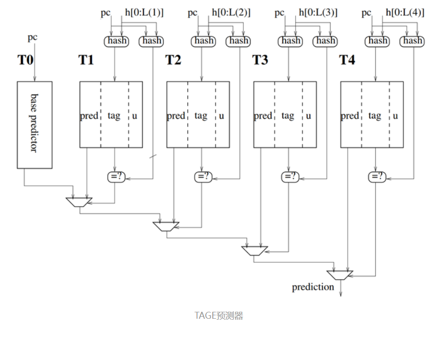
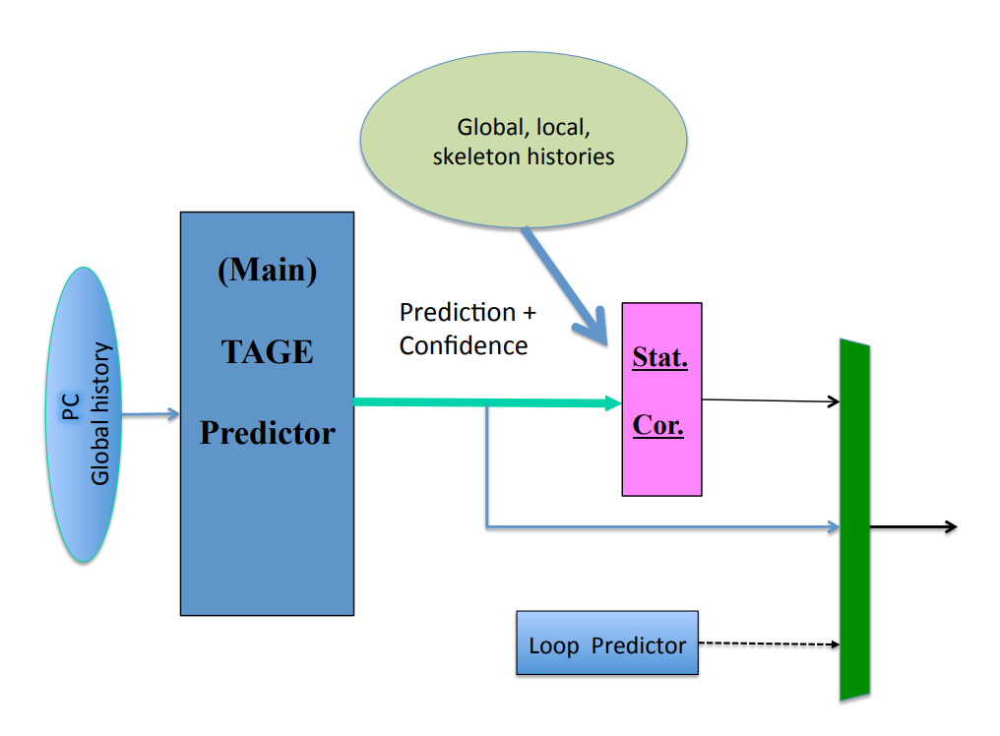
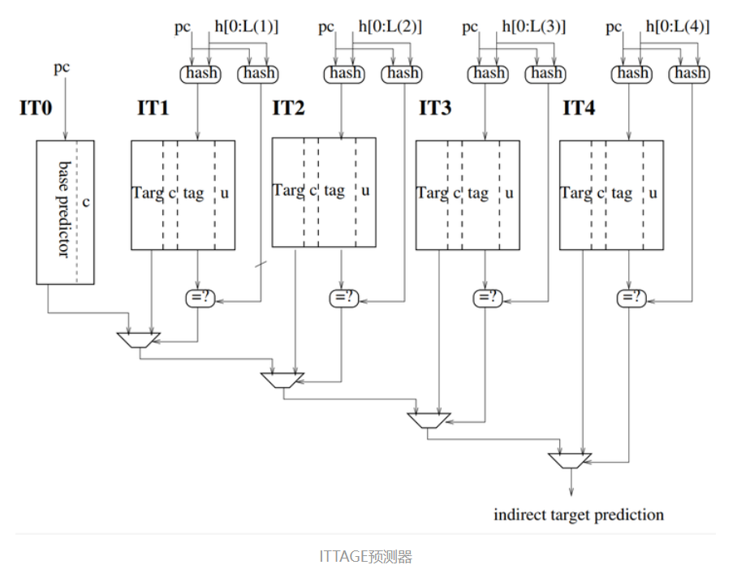
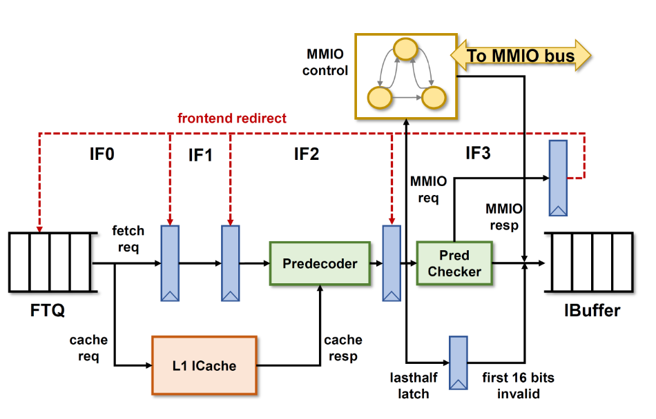

### 一.整体概览

​		根据香山文档的划分，南湖架构的前端部分包含有分支预测单元（Branch Prediction Unit)，取指目标队列（Fetch Target Queue），取指单元（IFU），指令缓存（Instruction Buffer），译码器（Decoder）和ICache，ITLB组成，下图为香山文档中给出的前端部分结构示意图。


### 二、模块分析

#### （一）.分支预测单元（Branch Prediction Unit）

​	BPU的具体实现模块为xiangshan/frontend/BPU.scala中的Predictor类，此外还有一个FakePredictor模块，该模块是一个“假”的分支预测单元，当要预测的PC到来时只会空转三个周期，last_stage_meta信号恒为0。

​	BPU的参数设置在BPU.scala的HasBPUConst中，内容如下：

```scala
trait HasBPUConst extends HasXSParameter {
  val MaxMetaLength = if (!env.FPGAPlatform) 512 else 256 // TODO: Reduce meta length
    //最大历史长度
  val MaxBasicBlockSize = 32			//该参数只在BPU.scala中的BranchPredictionUpdate中被使用，但已被注释。现行香山使用的BranchPredictionUpdate模块位于FrontendBundle.scala中，其中没有使用该参数
  val LHistoryLength = 32				//在代码中未见使用
  // val numBr = 2						//每次能够预测的分支指令的最大数量。被移至HasXSParameter中
  val useBPD = true						//是否开启分支预测，为1时实例化Composer，为0时实例化FakePredictor
  val useLHist = true					//在代码中未见使用
  val numBrSlot = numBr-1				//FTB中
  val totalSlot = numBrSlot + 1

  def BP_STAGES = (0 until 3).map(_.U(2.W))		
  def BP_S1 = BP_STAGES(0)						
  def BP_S2 = BP_STAGES(1)						
  def BP_S3 = BP_STAGES(2)						
  val numBpStages = BP_STAGES.length			//分支预测单元的内部流水级总数

  val debug = true
  // TODO: Replace log2Up by log2Ceil
}
```

香山的BPU以预测块为单位进行，在默认参数下（FetchWidth=8）预测块的大小为64个字节。BPU由uBTB、FTB、TAGE-SC、RAS、ITTAGE五个模块组成，其中uBTB为只使用PC索引的目标地址的BTB（无tag对比），1周期内完成预测；FTB的结构类似于cache，用PC的高20位作为tag索引，低十二位用于索引对应的bank。FTB作为TAGE预测器中的Base Predictor，与TAGE预测器一样都是2周期完成预测。SC统计矫正器用于校正TAGE的预测结果，在TAGE不够准确时反转TAGE的预测方向。ITTAGE基本上是一个在表项上多记录了预测的跳转地址的TAGE预测器，用于预测间接跳转，和SC一样延迟都为3个周期。以下是香山文档中给出的分支预测单元流水线示意图：


 BPU中每个模块都继承自抽象类BasePredictor，统一了各个预测器的接口。

```scala
class BasePredictorIO (implicit p: Parameters) extends XSBundle with HasBPUConst {
  val reset_vector = Input(UInt(PAddrBits.W))
  val in  = Flipped(DecoupledIO(new BasePredictorInput)) // TODO: Remove DecoupledIO
  // val out = DecoupledIO(new BasePredictorOutput)
  val out = Output(new BasePredictorOutput)
  // val flush_out = Valid(UInt(VAddrBits.W))

  val ctrl = Input(new BPUCtrl)

  val s0_fire = Input(Bool())		//理解为流水线的锁存信号，置为有效时数据将流向下一个流水级
  val s1_fire = Input(Bool())		
  val s2_fire = Input(Bool())
  val s3_fire = Input(Bool())
									//越靠后完成预测的预测器越精准
  val s2_redirect = Input(Bool())
  val s3_redirect = Input(Bool())

  val s1_ready = Output(Bool())			
  val s2_ready = Output(Bool())
  val s3_ready = Output(Bool())

  val update = Flipped(Valid(new BranchPredictionUpdate))		//从FTQ传入的更新信息
  val redirect = Flipped(Valid(new BranchPredictionRedirect))	//重定向信息
}
```

​	顶层模块BPU主要完成对各个分支预测子模块的实例化，流水线的管理以及全局分支历史的管理。全局分支历史管理通过一个优先多路选择器实现，由于对分支指令结果的预测是从s0流水级开始的，全局历史的选择也在这一流水级内进行。s0_fold_gh的来源按照优先级从低到高排序结果如下：

| 选择信号          | 来源             | 优先级 | 备注                                      |
| ----------------- | ---------------- | ------ | ----------------------------------------- |
| true              | s0_folded_gh_reg | 0      | 流水线阻塞                                |
| do_redirect.valid | update_ptr       | 2      | 发生新的重定向请求                        |
| s3_redirect       | s3_predict_fh    | 3      | s3级的重定向请求                          |
| s1_valid          | s1_predicted_fh  | 4      | s1_valid在代码中被初始化为0，未见其它赋值 |
| s2_redirect       | s2_predicted_fh  | 5      | s2级的重定向请求                          |


##### 1.微目标地址缓存（Micro Branch Target Buffer）

<font color=#FF0000 >香山的官方文档中提到在uBTB中摒弃了tag对比的做法，直接使用分支历史和PC的低位异或得到的结果来寻址存储表，但我在FauFTB.scala中看到这个模块仍然有tag对比的行为，本部分准确度存疑。Fa前缀可能是fake的意思。</font>

uBTB以一整个预测块为单位，提供无气泡的简单预测，其实现位于xiangshan/frontend/FauFTB.scala中。uBTB的组成类似于cache，其参数位于一个trait FauFTBParams中：

```scala
trait FauFTBParams extends HasXSParameter with HasBPUConst {
  val numWays = 32
  val tagSize = 16

  //在uBTB中未使用
  val TAR_STAT_SZ = 2
  def TAR_FIT = 0.U(TAR_STAT_SZ.W)
  def TAR_OVF = 1.U(TAR_STAT_SZ.W)
  def TAR_UDF = 2.U(TAR_STAT_SZ.W)

  //两种分支指令的偏移量长度。BTB中不直接记录跳转地址，而是记录偏移量并将其与当前预测的PC值的高位拼接形成目标地址。
  def BR_OFFSET_LEN = 12		
  def JMP_OFFSET_LEN = 20

  def getTag(pc: UInt) = pc(tagSize+instOffsetBits-1, instOffsetBits)
}
```

uBTB的行为如下：

s0流水级：

- 若u.valid有效，则将从外部传入的BTB更新信息的tag与表项中的tag对比
- 否则，将当前预测的PC值的tag部分与表项中的tag对比

s1流水级：

- 若u_s1_valid有效（延迟一拍的u.valid）则：
  - 若BTB命中，则将更新信息写入对应的BTB表项，并更新2-bit饱和计数器的值
  - 否则将更新信息写入PseudoLRU替换器指示的表项中

- 否则，根据2-bit饱和计数器的值预测分支方向


##### 2.取指目标缓存（Fetch Target Buffer）

FTB是香山里分支预测单元中精确预测器的核心部分，文档中提到FTB除了提供预测块内分支指令的信息外，还提供预测块的结束地址。其实现位于xiangshan/frontend/FTB.scala中，参数由trait FTBParams提供：

```scala
trait FTBParams extends HasXSParameter with HasBPUConst {
  val numEntries = FtbSize
  val numWays    = FtbWays
  val numSets    = numEntries/numWays // 512
  val tagSize    = 20
    
  //三个用于计算跳转地址的状态位
  val TAR_STAT_SZ = 2
  def TAR_FIT = 0.U(TAR_STAT_SZ.W)		//TARGET_FITTING
  def TAR_OVF = 1.U(TAR_STAT_SZ.W)		//TARGET_OVERFLOW
  def TAR_UDF = 2.U(TAR_STAT_SZ.W)		//TARGET_UNDERFLOW

  //不同分支指令的偏移量位宽
  def BR_OFFSET_LEN = 12	
  def JMP_OFFSET_LEN = 20
}		
```

根据香山的官方文档，FTB的表项满足以下特点：

- FTB项由预测块的起始地址start索引，start通常为上一个预测块的end或来自BPU外部的重定向的目标地址（如异常）
- FTB项内最多记录两条分支指令，其中第一条一定是条件分支指令
- end一定满足以下条件之一：
  - end - start = 预测宽度
  - end为从start开始的预测宽度范围内第三条分支指令的PC
  - end是一条无条件跳转分支指令的吓一跳指令的PC，同时它在从start开始的预测宽度范围内

FTB所使用的存储表定义在class FTB内定义并实例化，名称为FTBBank。表中存放的数据结构为FTBEntryWithTAG，这个类只是在另一个名为FTBEntry的类的基础上添加了tag段。FTBEntry的结构定义位于FrontendBundle.scala中，内容如下：

```scala
class FTBEntry(implicit p: Parameters) extends XSBundle with FTBParams with BPUUtils {
  val valid       = Bool()		//valid：表项有效位
  val brSlots = Vec(numBrSlot, new FtbSlot(BR_OFFSET_LEN))	//brSlots：分支指令的预测跳转地址
  val tailSlot = new FtbSlot(JMP_OFFSET_LEN, Some(BR_OFFSET_LEN))	//tailSlot: 预测块的结束地址

  // Partial Fall-Through Address
  val pftAddr     = UInt(log2Up(PredictWidth).W)	//下一个预测块的低位地址，当预测结果为not taken时，下一个预测块的起始地址为Cat(高位PC, pftAddr, 0.U(log2Ceil(指令占用字节数)).W)。若carry为1.B，则高位PC需要进位（即起始地址为Cat(高位PC+1, pftAddr, ...)）
  val carry       = Bool()			//用于计算下一个预测块
  val isCall      = Bool()			//跳转指令的类型
  val isRet       = Bool()
  val isJalr      = Bool()
  val last_may_be_rvi_call = Bool()	//疑似是判断是否为压缩后的call指令

  val always_taken = Vec(numBr, Bool())	//预测跳转总是发生的计数器，当该位为1时，预测对应的跳转指令结果为总是跳转，此时不以其结果训练预测器；
   //当遇到不跳转情况时，将该位置0

	//这里省略了类中定义的其它函数
}
```

​	与一般BTB中直接存储跳转的目的地址不同，FTBEntry只存储地址的低位（pftAddr），并将其与高位拼接来得到下一个预测块的起始地址。当预测结果为not taken时，下一个取指块的地址就由ptfAddr和当前预测块的PC高位拼接得到。这段设计来自于论文《A scalable front-end architecture for fast instruction delivery》。

跳转地址的存储使用了另一个数据结构FtbSlot：

```scala
//offsetLen: 不同分支指令的跳转偏移长度，有JMP_OFFSET_LEN（20位）和BR_OFFSET_LEN（12位）两种值
//subOffsetLen: 目前只见于FTBEntry中的tailSlot里使用
class FtbSlot(val offsetLen: Int, val subOffsetLen: Option[Int] = None)(implicit p: Parameters) extends XSBundle with FTBParams {
  if (subOffsetLen.isDefined) {
    require(subOffsetLen.get <= offsetLen)
  }
  val offset  = UInt(log2Ceil(PredictWidth).W)	//
  val lower   = UInt(offsetLen.W)		//跳转的偏移量
  val tarStat = UInt(TAR_STAT_SZW)		//跳转目标的类型
  val sharing = Bool()					//若slot中存储的是预测块内能够预测的最后一条条件分支指令（第numBr条分支指令），该位置为1
  val valid   = Bool()					

  val sc      = Bool() // 用于预取
  	//这里省略了类中定义的其它函数
}
```

​	跳转的目标地址依旧是由PC的高位和偏移量拼接完成，不过与fall-through addr不同的是跳转的方向可以是向上也可以是向下的，因此需要一个tarStat状态位指示PC高位是否需要+1或-1。如一个jal指令的预测跳转地址计算方式应该是**Cat(**  PC高位, lower(offLen-1, 0), 0.U(1.W)  **)** 。


其他诸如查询和更新的行为就与FauBTB比较类似了，FTB的行为如下：

当update_valid为0时：

s0流水级：

- 将s0_pc（最新的预测块的起始地址）的tag段和Index段分别锁存至req_tag和req_idx内
- 以s0_pc的Index段向FTB使用的SRAM发送读请求。

s1流水级：

- 将req_tag内的值与表项中的tag对比，记录命中情况s1_hit
- 若s1_fire有效，锁存住s1_hit的值到s2_hit中
- 若s1_fire有效，将从FTB读出的信息锁存至ftb_entry中

s2流水级：

- 当s2_hit有效且ftb_entry中的always_taken域有效，或者从TAGE预测器传入的预测信息中s2的预测信息表示预测发生跳转时，设置s2的br_taken_mask为1，表示预测发生跳转。
- 若s2_fire有效，锁存s2_hit的值到s3_hit中
- 若s2_fire有效，锁存ftb_entry的值到s3_ftb_entry中

s3流水级：

- 当s3_hit有效且s3_ftb_entry中的always_taken域有效，或从TAGE预测器传入的预测信息中s3的预测信息表示预测发生跳转时，设置s3的br_taken_mask为1，表示预测发生跳转。

当update_valid为1时：

- u_meta.hit为1时，update_now为1，此时writeWay由u_meta.writeWay给出，将数据直接写入FTB中：

- u_meta.hit为0时，update_now为0，此时writeWay依赖于tag对比。注意由于FTB使用的是单端口SRAM，故在此需要通过将s1_ready置0以阻塞流水线来实现u_req_tag和表项中tag的比较。SRAM的写行为需要在tag对比完成之后，因此update.pc，update.entry和SRAM的写有效信号均需要延迟两周期（在代码中为delay2_pc，delay2_entry）。
  - s0流水级：
    - 将update_pc的tag段锁存至u_req_tag内。
    - 以uodate_pc的index段为地址向SRAM发送读请求。
    - 由于流水线阻塞，req_tag和req_idx保留原来的值。
  - s1流水级：
    - 将u_req_tag与表项中的tag段对比，记命中情况为u_hit。
    - 由于流水线阻塞，req_tag和req_idx保留原来的值。
  - s2流水级：
    - 若未命中，则分配一个新的way写入更新信息。
    - 若命中，则将更新信息写入命中的way中。
    - 流水线阻塞解除，req_tag和reg_idx按照s0_pc更新。

​	FTB使用的SRAM从接受读请求到返回数据需要两个周期，因此当update_valid刚置为1时，s0级已发送的请求在s1所返回的预测数据就会流水线阻塞的原因而丢失。为了避免这种情况发生，香山会在发生update的时候将读出来的预测信息暂时锁存住，直到流水线阻塞解除。这在代码层面上通过object HoldUnless完成：

```scala
val pred_rdata   = HoldUnless(ftb.io.r.resp.data, RegNext(io.req_pc.valid && !io.update_access))	
//当req_pc.valid && !update_access为0时，保存原值；为1时pred_rdata = ftb.io.r.resp.data

//原型
object HoldUnless {
  def apply[T <: Data](x: T, en: Bool): T = Mux(en, x, RegEnable(x, 0.U.asTypeOf(x), en))
}
```

##### 3.TAGE预测器

​	TAGE（Tagged GEometrical Length Predictor）分支预测是综合O-GEHL分支预测和PPM-like分支预测所设计的分支预测算法。由base predictor T0，和一序列（partially）tagged predictor components Ti组成，tagged predictor components Ti所采用索引历史长度是不同的，成几何长度关系。从它的名称上就可以看出来设计上的特点：

1.TA（Taged）:

​	由于分支预测的索引通常为PC或者PC和全局历史的hash值，一般为了提高存储效率PC只有部分段用于索引，因此会有造成别名（aliasing），TAGE中带有tag的设计能够更好地处理这一问题。

2.GE（GEoimetrical）

​	主流观点认为一般global history match的长度越大，预测就越准确。所以TAGE选取了几何增长的history长度，如32，64，128，256。原则上，每次优先选取最长的match做预测。当然也有一些简单地branch可能不需要那么长，短的就好。TAGE的userful counter 就发挥了作用。如果短的history predict的效果就很好，就会通过useful counter 反映出来。

更详细的原理介绍参见[这篇专栏](https://zhuanlan.zhihu.com/p/621735156)或[这篇论文](https://jilp.org/cbp2014/paper/AndreSeznec.pdf#:~:text=The%20submitted%20256Kbits%20TAGE-SC-L%20predictor%20features%20a%20TAGE,predictor%20achieves%202.365%20MPKI%20on%20the%20CBP-4%20traces.)。



​	图中的base predictor就是一个简单的由饱和计数器组成的预测器，当所有bank都没有命中时就会采用base predictor的预测结果。香山中的base predictor实现位于xiangshan/frontend/Tage.scala中的TageBTable类。其他的Tagged Predictor使用的是TageTable类，被称为Provider。

​	在没有发生update的情况下，TAGE的时序逻辑比较简单，只需要以s0_pc的idx段和tag段索引SRAM，在s1读出预测数据并选择历史长度最长的预测器的预测结果，该预测器被称为provider。如果没有命中任何预测器，则会使用base predictor的预测结果。此外，香山还参考了[这篇论文](https://www.irisa.fr/caps/people/seznec/L-TAGE.pdf)实现了一个**备选预测（Alternative Provider)**的逻辑。备选预测（altpred）是命中的预测器中具有第二长度的预测器（若没有命中则为base predictor）。论文中提到在一些情况下（比如最长历史项是刚刚分配出来的新项）altpred的结果比provider要更准确，因此还设置了一个USE_ALT_ON_NA寄存器，用以指示是否使用备选预测器的预测结果。香山中处于时序的考虑，始终使用base predictor作为备选预测的结果。

​	注意香山中的TAGE预测器与FTB一样，能够同时预测numBr条（目前numBr = 2）分支指令的结果，因此TAGE的预测表中一个表项也最多能够存储两条分支指令的结果。同时，香山的TAGE内没有存储分支指令的跳转地址（这个功能已经由FTB完成了），TAGE只是简单地预测分支是否发生（taken or not）。

s0流水级：

- Base Predictor：

  - 直接以s0_pc的idx段（s0_idx）为地址访问base predictor使用的预测表。

  - 当s0_fire有效时，锁存s0_idx到s1_idx中。

- Tagged Predictor：

  - 将s0_pc与分支表的历史进行异或hash得到s0_idx，用于索引预测表。
  - 将s0_pc与分支表的历史进行异或hash得到s0_tag。
  - 当s0_fire有效时，分别锁存s0_idx和s0_tag到s1_idx和s1_tag中。

- 在Tage的顶层模块中还涉及到如下信号：

  - provided:   是否命中至少一个Tagged Predictor。
  - providerInfo: 命中的Tagged Predictor的index以及预测数据，若无命中

s1流水级：

- Base Predictor：

  - 直接输出预测表中的预测数据。

- Tagged Predictor:

  - 将s1_tag与预测表中的tag对比，记录每条分支指令（至多numBr条）的命中情况为per_br_hit。

  - 根据per_br_hit和预测表中的值输出预测数据

    ```scala
      for (i <- 0 until numBr) {
        io.resps(i).valid := per_br_hit(i)		
        io.resps(i).bits.ctr := per_br_resp(i).ctr	//饱和计数器
        io.resps(i).bits.u := per_br_u(i)	//useful域
        io.resps(i).bits.unconf := per_br_unconf(i)
      }
    ```

- 在Tage的顶层模块中还涉及到如下信号：

  - s1_provideds:  锁存自provided
  - s1_providers:  命中的历史最长的预测器的编号（index），锁存自providerInfo.tableIndex。
  - s1_altUsed: 是否使用备选逻辑。当provided为0或USE_ALT_ON_NA指示使用备选预测时，在下一周期被置为1。
  - s1_baseCnt: 锁存自从base predictor中读出的饱和计数器的值。
  - s1_finalAltPreds: 备选逻辑的预测结果。锁存自从base predictor中读出的饱和计数器的最高位。
  - s1_tageTakens: 预测结果，为1表示taken。当s1_altUsed为1时，取base predictor的预测结果。否则取providerInfo中的预测结果。

s2流水级：

- 将s1级的各信号锁存一拍，对外输出预测结果


  **TAGE的更新：待补充**

​		实际上TAGE预测器在应用上除了与SC（statistical corrector，统计校正器）搭配以外还经常与循环预测器搭配使用，组成TAGE-SC-L预测器，如下图所示。香山在南湖架构中舍弃了循环预测器，因为南湖架构中的分支预测单元是以预测块为单位进行预测，一条分支指令可能会存在于多个FTB项内，统计一条分支指令的循环次数比较困难。而在雁栖湖架构中，对每一条指令都会做出预测，一条分支指令在 BTB 中只会出现一次，故没有上述的问题。



##### 3.统计校正器（Statistical Corrector）

​	TAGE在预测与历史较相关的分支时非常有效，但对一些有统计偏向的分支效果不佳，如一条只对一个方向有微小的偏差，但与历史路径没有强相关性的分支。统计校正器SC负责在预测这种具有统计偏向的条件分支指令并在这种情况下反转TAGE预测器的结果。

##### 4.ITTAGE预测器

​	ITTAGE预测器是专门用于预测间接跳转指令的预测器，其预测算法与TAGE一致，只是在预测表中加上了跳转到的目标地址，故原理在此不作重复。



#### （二）取指目标队列（Fetch Target Queue）

​	由于BPU在设计上与指令缓存进行了解耦，IFU和BPU所使用的PC被独立开来。而BPU中很少出现阻塞的情况，流水线的效率要大于需要访问Cache的IFU，为了最大化流水线的效率，香山设计了一个取指目标队列（FTQ）用于暂存BPU中已经完成预测的取指块，并向IFU发送取指令请求。除此之外，FTQ中还存储了BPU中各个预测器的预测信息（meta），在指令确认退休后，FTQ会将这些信息送回BPU用作预测器的训练，故它需要维护指令从预测到提交的完整的生命周期。除此之外，当后端需要指令PC时也会到FTQ中获得。

#### （三）取指令单元（Instuction Fetch Unit)

​	取指令单元的实现位于xiangshan/frontend/IFU.scala中。南湖架构的IFU采用了四级流水线的结构，


