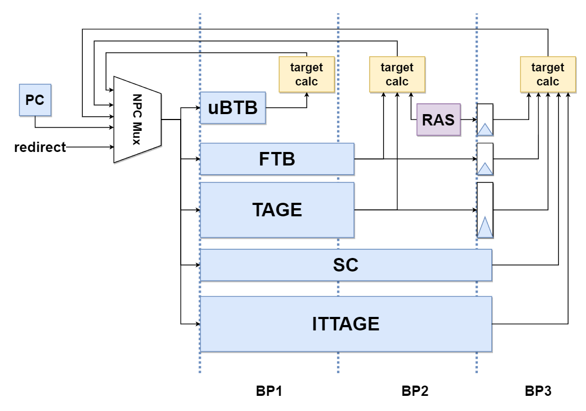

### 一.整体概览

​		根据香山文档的划分，南湖架构的前端部分包含有分支预测单元（Branch Prediction Unit)，取指目标队列（Fetch Target Queue），取指单元（IFU），指令缓存（Instruction Buffer），译码器（Decoder）和ICache，ITLB组成，下图为香山文档中给出的前端部分结构示意图。


### 二、模块分析

#### （一）.分支预测单元（Branch Prediction Unit）

​	BPU的具体实现模块为xiangshan/frontend/BPU.scala中的Predictor类，此外还有一个FakePredictor模块，该模块是一个“假”的分支预测单元，当要预测的PC到来时只会空转三个周期，last_stage_meta信号恒为0，

​	BPU的参数设置在BPU.scala的HasBPUConst中，内容如下：

```scala
trait HasBPUConst extends HasXSParameter {
  val MaxMetaLength = if (!env.FPGAPlatform) 512 else 256 // TODO: Reduce meta length
    //最大历史长度
  val MaxBasicBlockSize = 32			//该参数只在BPU.scala中的BranchPredictionUpdate中被使用，但已被注释。现行香山使用的BranchPredictionUpdate模块位于FrontendBundle.scala中，其中没有使用该参数
  val LHistoryLength = 32				//在代码中未见使用
  // val numBr = 2						//每次能够预测的分支指令的最大数量。被移至HasXSParameter中
  val useBPD = true						//是否开启分支预测，为1时实例化Composer，为0时实例化FakePredictor
  val useLHist = true					//在代码中未见使用
  val numBrSlot = numBr-1				//FTB中
  val totalSlot = numBrSlot + 1

  def BP_STAGES = (0 until 3).map(_.U(2.W))		
  def BP_S1 = BP_STAGES(0)						
  def BP_S2 = BP_STAGES(1)						
  def BP_S3 = BP_STAGES(2)						
  val numBpStages = BP_STAGES.length			//分支预测单元的内部流水级总数

  val debug = true
  // TODO: Replace log2Up by log2Ceil
}
```

香山的BPU以预测块为单位进行，在默认参数下（FetchWidth=8）预测块的大小为64个字节。BPU由uBTB、FTB、TAGE-SC、RAS、ITTAGE五个模块组成，其中uBTB为只使用PC索引的目标地址的BTB（无tag对比），1周期内完成预测；FTB的结构类似于cache，用PC的高20位作为tag索引，低十二位用于索引对应的bank。FTB作为TAGE预测器中的Base Predictor，与TAGE预测器一样都是2周期完成预测。SC统计矫正器用于校正TAGE的预测结果，在TAGE不够准确时反转TAGE的预测方向。ITTAGE基本上是一个在表项上多记录了预测的跳转地址的TAGE预测器，用于预测间接跳转，和SC一样延迟都为3个周期。以下是香山文档中给出的分支预测单元流水线示意图：



 BPU中每个模块都继承自抽象类BasePredictor，统一了各个预测器的接口。

```scala
class BasePredictorIO (implicit p: Parameters) extends XSBundle with HasBPUConst {
  val reset_vector = Input(UInt(PAddrBits.W))
  val in  = Flipped(DecoupledIO(new BasePredictorInput)) // TODO: Remove DecoupledIO
  // val out = DecoupledIO(new BasePredictorOutput)
  val out = Output(new BasePredictorOutput)
  // val flush_out = Valid(UInt(VAddrBits.W))

  val ctrl = Input(new BPUCtrl)

  val s0_fire = Input(Bool())		//理解为流水线的锁存信号，置为有效时数据将流向下一个流水级
  val s1_fire = Input(Bool())		
  val s2_fire = Input(Bool())
  val s3_fire = Input(Bool())

  val s2_redirect = Input(Bool())
  val s3_redirect = Input(Bool())

  val s1_ready = Output(Bool())			
  val s2_ready = Output(Bool())
  val s3_ready = Output(Bool())

  val update = Flipped(Valid(new BranchPredictionUpdate))
  val redirect = Flipped(Valid(new BranchPredictionRedirect))
}
```


##### 1.微目标地址缓存（Micro Branch Target Buffer）

<font color=#FF0000 >香山的官方文档中提到在uBTB中摒弃了tag对比的做法，直接使用分支历史和PC的低位异或得到的结果来寻址存储表，但我在FauFTB.scala中看到这个模块仍然有tag对比的行为，本部分准确度存疑。Fa前缀可能是fake的意思。</font>

uBTB以一整个预测块为单位，提供无气泡的简单预测，其实现位于xiangshan/frontend/FauFTB.scala中。uBTB的组成类似于cache，其参数位于一个trait FauFTBParams中：

```scala
trait FauFTBParams extends HasXSParameter with HasBPUConst {
  val numWays = 32
  val tagSize = 16

  val TAR_STAT_SZ = 2
  def TAR_FIT = 0.U(TAR_STAT_SZ.W)
  def TAR_OVF = 1.U(TAR_STAT_SZ.W)
  def TAR_UDF = 2.U(TAR_STAT_SZ.W)

  //两种分支指令的偏移量长度。BTB中不直接记录跳转地址，而是记录偏移量并将其与当前预测的PC值的高位拼接形成目标地址。
  def BR_OFFSET_LEN = 12		
  def JMP_OFFSET_LEN = 20

  def getTag(pc: UInt) = pc(tagSize+instOffsetBits-1, instOffsetBits)
}
```

uBTB的行为如下：

s0流水级：

- 若u.valid有效，则将从外部传入的BTB更新信息的tag与表项中的tag对比
- 否则，将当前预测的PC值的tag部分与表项中的tag对比

s1流水级：

- 若u_s1_valid有效（延迟一拍的u.valid）则：
  - 若BTB命中，则将更新信息写入对应的BTB表项，并更新2-bit饱和计数器的值
  - 否则将更新信息写入PseudoLRU替换器指示的表项中

- 否则，根据2-bit饱和计数器的值预测分支方向


##### 2.取指目标缓存（Fetch Target Buffer）

FTB是香山里分支预测单元中精确预测器的核心部分，文档中提到FTB除了提供预测块内分支指令的信息外，还提供预测块的结束地址。其实现位于xiangshan/frontend/FTB.scala中，参数由trait FTBParams提供：

```scala
trait FTBParams extends HasXSParameter with HasBPUConst {
  val numEntries = FtbSize
  val numWays    = FtbWays
  val numSets    = numEntries/numWays // 512
  val tagSize    = 20
    
  val TAR_STAT_SZ = 2
  def TAR_FIT = 0.U(TAR_STAT_SZ.W)
  def TAR_OVF = 1.U(TAR_STAT_SZ.W)
  def TAR_UDF = 2.U(TAR_STAT_SZ.W)

  //不同分支指令的偏移量位宽
  def BR_OFFSET_LEN = 12	
  def JMP_OFFSET_LEN = 20
}		
```

根据香山的官方文档，FTB的表项满足以下特点：

- FTB项由预测块的起始地址start索引，start通常为上一个预测块的end或来自BPU外部的重定向的目标地址（如异常）
- FTB项内最多记录两条分支指令，其中第一条一定是条件分支指令
- end一定满足以下条件之一：
  - end - start = 预测宽度
  - end为从start开始的预测宽度范围内第三条分支指令的PC
  - end是一条无条件跳转分支指令的吓一跳指令的PC，同时它在从start开始的预测宽度范围内

FTB所使用的存储表定义在class FTB内定义并实例化，名称为FTBBank，其参数和行为与FauBTB类似，FTB的行为如下：

当没有update行为发生时：

s0流水级：

- 将s0_pc（最新的预测块的起始地址）的tag段锁存至req_tag内

s1流水级：

- 将req_tag内的值与表项中的tag对比，记录命中情况s1_hit
- 若s1_fire有效，锁存住s1_hit的值到s2_hit中
- 若s1_fire

s2流水级：

- 当s1_hit有效且s1阶段读出的FTB表项中的always_taken域有效，或者从TAGE预测器传入的预测信息中s2的预测信息表示预测发生跳转时，设置预测结果为发生跳转。

s3流水级：

- 


